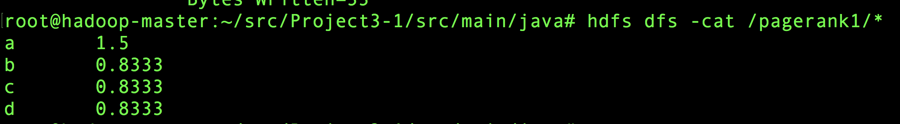
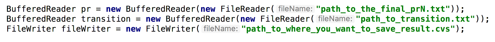
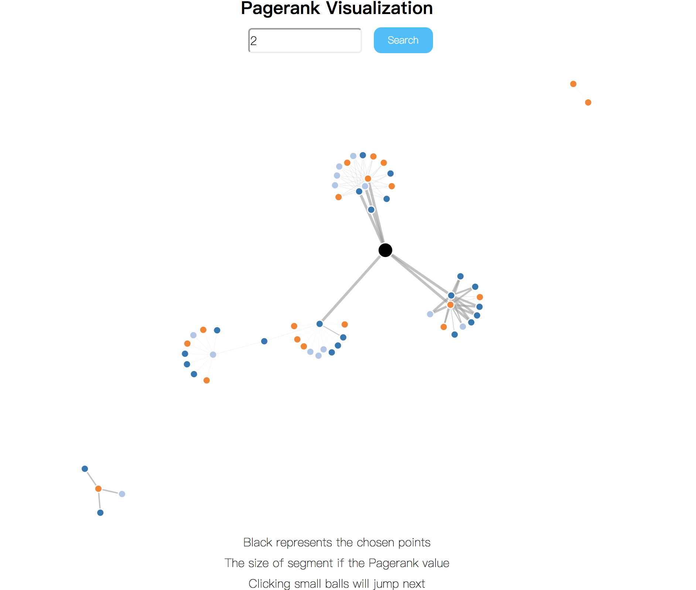
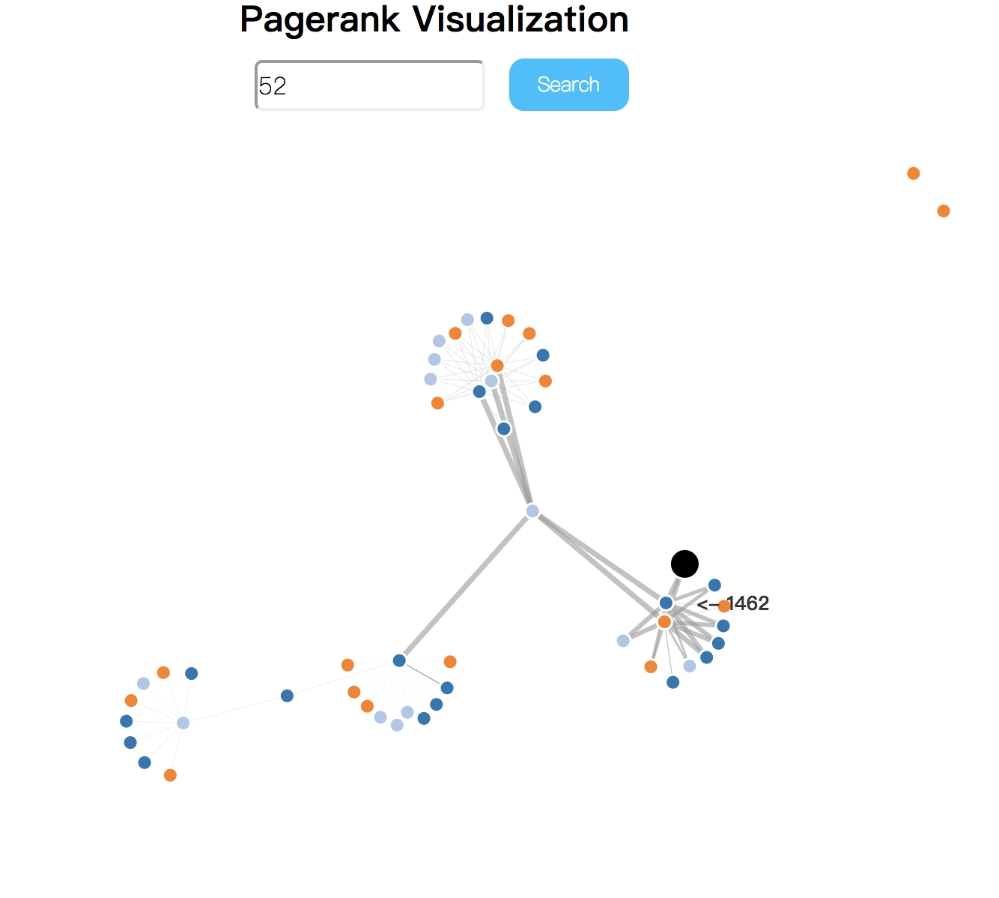

# Google-Pagerank
Google Pagerank Application Based On Hadoop Offline 

Testing Dataset
-----
  * [Click Here](http://www.limfinity.com/ir/)

## Go Into Hadoop
``` shell
cd ~/src 
git clone https://github.com/carsonluuu/Google-Pagerank/Final
./start-container.sh # Set up docker container  
./start-hadoop.sh # Set up hadoop
cd src/main/java/
```

## Setting Up Files
``` shell
hdfs dfs -rm -r /transition 
hdfs dfs -mkdir /transition 
hdfs dfs -put transitionsmall.txt /transition
hdfs dfs -rm -r /output* 
hdfs dfs -rm -r /pagerank* 
hdfs dfs -mkdir /pagerank0 
hdfs dfs -put prsmall.txt /pagerank0 #uploading PR0
hadoop com.sun.tools.javac.Main *.java # compile java scourse code
jar cf pr.jar *.class 
hadoop jar pr.jar Driver /transition /pagerank /output 1 #run jar
//args0: dir of transition.txt
//args1: dir of PageRank.txt
//args2: dir of unitMultiplication result
//args3: times of convergence（make sure the code run successfully when args3=1, then test args3=40）
```

Output is under: /pagerankN（N=iteration times）
```hdfs dfs -cat /pagerank1/* #check result```


## Generating CVS
```
hdfs dfs -get <src> <localDest>
#Examples：
hdfs dfs -get /pagerank30/part-r-00000 pr30.txt
#Open Helper.java，change：
#args1： The local location for PRN file
#args2： transition.txt
#args3： loction for result.csv output
#Run Helper.main()
```


## Results


